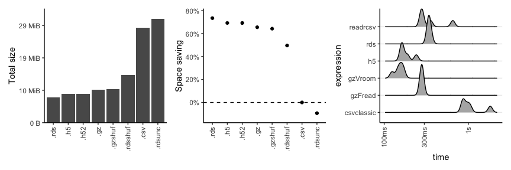

# Testing HDF5 in R

The package that I found can be used for HDF5 in R is rhdf5. It is a
wrapper for the C library HDF5. The package is available on
bioconductor,
[here](https://www.bioconductor.org/packages/devel/bioc/vignettes/rhdf5/inst/doc/rhdf5.html).

The idea is to try multiple ways to store the data, see how they
compress the data against the baseline CSV format and how fast can you
read from them.

## Conclusion

The idea is that the rds is better in comrpession (by little), if used
accordingly. It’s not obvious how to use accordingly though.

The hdf5 however seems to be faster to read however there is a weird way
to do so.

## Code

``` r
set.seed(42)

library(ggplot2)
library(rhdf5)
library(magrittr)

all_exp_files = c(
  "test.h5",
  "test2.h52",
  "test.rds",
  "test.rdsunc",
  "test.csv.gz",
  "test.csv.gzshuf",
  "test.csv",
  "test.rdsshuf"
)

all_exp_files %>% 
  .[fs::file_exists(.)] -> all_exp_files2rm
fs::file_delete(all_exp_files2rm)

# a lot of data
data.frame(
  repeated_value = "chr1",
  non_repeared_value = sample(3e8,
                              replace = F,
                              size = 1e6)
) -> rep_data

data.frame(
  repeated_value = "chr2",
  non_repeared_value = sample(3e8,
                              replace = F,
                              size = 1e6)
) -> rep_data2

all <- rbind(rep_data, 
             rep_data2)

all_shuf = all[sample(nrow(all)),]

saveRDS(all, "test.rds")
saveRDS(all, "test.rdsunc",
        compress = FALSE)

saveRDS(all_shuf, "test.rdsshuf",
        compress = TRUE)

readr::write_csv(all, "test.csv")
R.utils::gzip("test.csv", remove = FALSE)

readr::write_csv(all_shuf, "test.csvshuf")
R.utils::gzip("test.csvshuf",
              destname = "test.csv.gzshuf",
              remove = FALSE)

h5save(all, file = "test.h5")

h5createFile("test2.h52")
h5createGroup("test2.h52","chr1")
```

    ## [1] TRUE

``` r
h5createGroup("test2.h52","chr2")
```

    ## [1] TRUE

``` r
h5write(rep_data, "test2.h52","chr1/vals")
h5write(rep_data2, "test2.h52","chr2/vals")

# reset session
all_vars = ls()
all_vars %<>% .[. != "all_exp_files"] 
rm(list=all_vars)

purrr::map(all_exp_files, 
           fs::file_info)  %>%
  dplyr::bind_rows() -> df

df$path %>% 
  stringr::str_extract("[.][:alnum:]+$") -> ext
df$ext = ext

df$ext = forcats::fct_reorder(.f = df$ext,
                              .x = df$size
)

ggplot(df, aes(x = ext, y = size)) + 
  geom_col() +
  theme_classic() + 
  scale_y_continuous(labels = scales::number_bytes,
                     expand = expansion(c(0,.1))) +
  theme(axis.text.x = element_text(angle = 90,
                                   hjust = 1,
                                   vjust = 0.5)) +
  labs(y = "Total size", x = "")-> p1

csv_val = dplyr::filter(df, ext == ".csv") %>% 
  dplyr::pull(size) %>% 
  as.numeric()

df$size_rel = (1 - (as.numeric(df$size) / csv_val)) %>% as.numeric()

ggplot(df, aes(x = ext, y = size_rel)) + 
  geom_point() +
  geom_hline(yintercept = 0, linetype = "dashed") + 
  theme_classic() + 
  scale_y_continuous(expand = expansion(c(0.1,.1)), labels = scales::percent) +
  theme(axis.text.x = element_text(angle = 90,
                                   hjust = 1,
                                   vjust = 0.5))+
  labs(y = "Space saving", x = "") -> p2

# reset session
all_vars = ls()
all_vars %<>% .[!. %in% c("all_exp_files", "p1", "p2")] 
rm(list=all_vars)


library(readr)
cols(
  repeated_value = col_character(),
  non_repeared_value = col_double()
) -> ctypes

bench::mark(
  csvclassic = {
    read.csv("test.csv") 
  },
  readrcsv = {
    readr::read_csv("test.csv", col_types = ctypes) %>% 
      as.data.frame()
  },
  gzVroom = {
    vroom::vroom("test.csv.gz", col_types = ctypes) %>% 
      as.data.frame()
  },
  gzFread = {
    data.table::fread("test.csv.gz") %>% 
      as.data.frame()
  },
  h5 = {
    def = h5dump("test.h5")$all
    outdf = data.frame(
      repeated_value = as.character(def$repeated_value),
      non_repeared_value = as.numeric(def$non_repeared_value)
    )
    outdf
  },
  rds = {
    readRDS("test.rds")
  },
  min_iterations = 5
) -> bm_df
```

    ## Warning: Some expressions had a GC in every iteration; so filtering is disabled.

``` r
autoplot(bm_df,type = "ridge") + theme_classic() +
  theme(axis.text.x = element_text(angle = 90, hjust = 1, vjust = 0.5)) + 
  theme(panel.grid.major.y = element_line())-> p3
```

    ## Loading required namespace: tidyr

    ## Picking joint bandwidth of 0.0516



    ## Picking joint bandwidth of 0.0516
